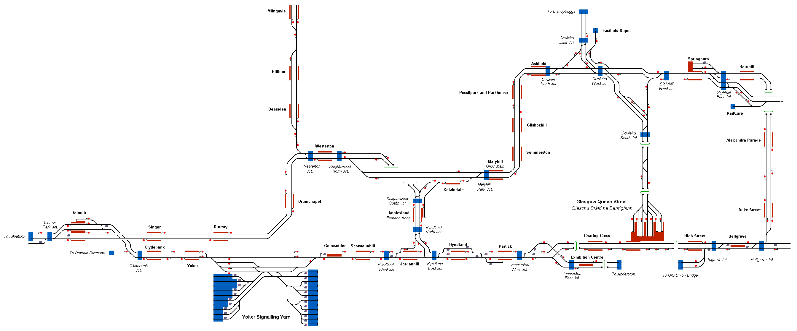

# Glasgow Suburban
Representation of the local rail network in th city of Glasgow, Scotland, UK originating from Glasgow Queen Street station.

## Current Status

| Stage         | Status        |
| ------------- |:-------------:|
| Track Plan     | :heavy_check_mark: |
| Signalling      | :heavy_check_mark:      |
| Naming | :heavy_check_mark:      |
| Speed Limits | :heavy_check_mark: |
| Distances | :heavy_check_mark: |
| Timetable | :x: |
| Documentation | :x: |

## Data Sources

- [OpenStreetMap](www.openstreetmap.org)
