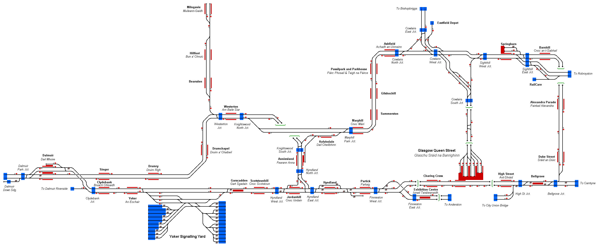

# Glasgow Suburban
Representation of the local rail network in th city of Glasgow, Scotland, UK originating from Glasgow Queen Street station.

## Current Status

| Stage         | Status        |
| ------------- |:-------------:|
| Track Plan     | :heavy_check_mark: |
| Signalling      | :heavy_check_mark:      |
| Naming | :heavy_check_mark:      |
| Speed Limits | :heavy_check_mark: |
| Distances | :heavy_check_mark: |
| Timetable | :heavy_check_mark: |
| Documentation | :heavy_check_mark: |

## Data Sources

- [OpenStreetMap](www.openstreetmap.org)
- [MapMeurisse](https://map.meurisse.org/)
- [OpenTrainTimes](https://www.opentraintimes.com)
- [National Rail Section Appendix Dec 2021 Scotland](https://sacuksprodnrdigital0001.blob.core.windows.net/sectional-appendix/Sectional%20Appendix%20full%20PDFs/Scotland%20Sectional%20Appendix%20December%202021.pdf)
